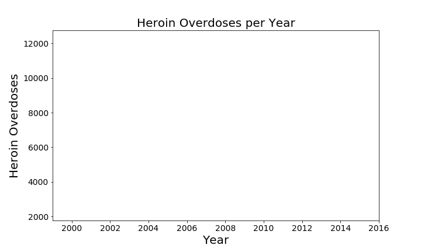
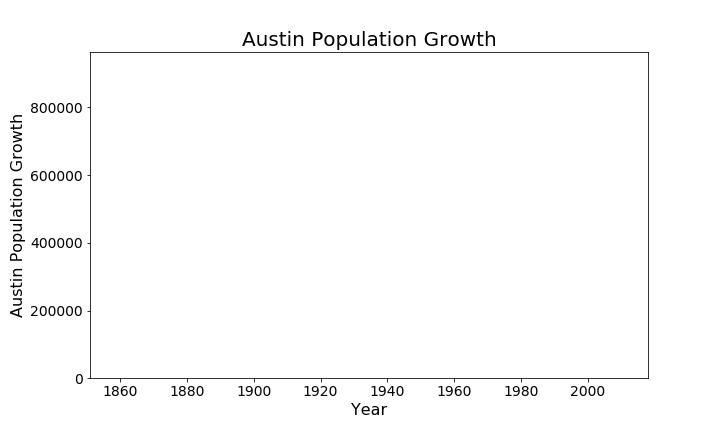
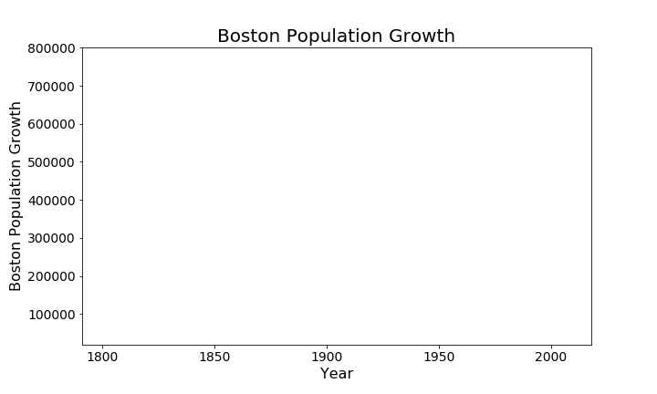

# pop-growth
This project was all about learning how to animate graphs using matplotlib and seaborn. Just enter a city and the script will generate what I call a "snake graph" depicting population growth over time.

Hours spent: 10

Topics explored:
- `matplotlib`
- `seaborn`
- `pandas` dataframes
- web scraping
- data cleaning
- data visualization
- animation


My inspiration to start this project came from a really interesting Medium article I read a while back. It was called [**How to Create Animated Graphs in Python**](https://towardsdatascience.com/how-to-create-animated-graphs-in-python-bb619cc2dec1 "Medium Article"). The article provided me with an introductory education of `Matplotlib` and `Seaborn` libraries. I knew that I wanted to do away with static graphs for this one because it's time to explore the next level of data vis. The example the article provided me with pertained to the opioid crisis in the USA. The plot that the author produced was an animation of number of heroin deaths by overdose in the USA over time. I have recreated that example in the [heroin overdoses file](heroin_overdoses_example.ipynb). 

Below is the animation as a GIF file:


I wanted to visualize something a little more light-hearted, and I also wanted to acquire the data with minimal effort. I did not want to download a massive Excel file and then use Python to extract the data from the cells and then create a Pandas dataframe. The alternative solution was right in front of me: I resorted to web scraping to get myself a nice table that I could quickly convert into a dataframe.

This is the code that let me scape the data:

```python
import requests
from bs4 import BeautifulSoup
city = input("Please enter a city: ")
r = requests.get('http://worldpopulationreview.com/us-cities/' + city + '-population/')
c = r.content
soup = BeautifulSoup(c, "lxml")
soup
main_content = soup.find('div', attrs = {'class': 'section-container clearfix'})
main_content
rows = main_content.find_all('tr')
```

As you can see above, the code is general and can be applied to any city in the US, depending on what the user enters in the input dialog box. Before I scaffolded each cell to make it completely general, I was using Portland, OR as my city of interest. I wanted to view its population growth over time, since it is a city that has recently popped up as a great place to live.

After I scraped the data, I did a fair amount of data cleaning because the format of the data from HTML inspection was not how I wanted it. I used the `re` library to accomplish string manipulation tasks.

The following two lines effectively initialized a writer which would be instrumental in making our animation object using the `matplotlib.animation.FuncAnimation` function:

```python
Writer = animation.writers['ffmpeg']
writer = Writer(fps=len(overdose[title])/2, metadata=dict(artist='Me'), bitrate=1800)
```

After that, I added a few lines of code to set up the figure and label my axes. Then, it was time to create the animation:

```python
def animate(j):
    data = overdose.iloc[:int(j+1)] #select data range
    p = sns.lineplot(x=data.index, y=data[title], data=data, color="b")
    p.tick_params(labelsize=14)
    plt.setp(p.lines,linewidth=2)
    
ani = animation.FuncAnimation(fig, animate, frames=len(overdose[title]), repeat=True)
ani.save(city + 'PopGrowth.gif', writer='imagemagick', fps=50)
```

The `frames` keyword argument in the `animation.FuncAnimation` call is probably the most critical part of the above code snippet. The number of frames determines how often `animate(i)` is going to be called, so in my case, it must correspond to the number of data points to be plotted. Then, in order to actually view the animation object `ani`, it must be saved as a .mp4 or .gif file.

This is how it turned out:





